# Ubuntu Nginx Web服务器安全运维项目实战

## 一、项目整体规划

### 项目目标

在Ubuntu 24.04 系统上完成：

1.掌握 Linux 服务器部署能力

2.实现 Web 服务安全加固

3.实现 SSH 安全防护

4.实现暴力破解防护（fail2ban）

5.编写 Nginx 日志分析脚本

6.使用 Kali 模拟攻击并通过日志分析识别攻击行为

### 项目整体阶段：

阶段1 Linux系统初始化

阶段2 Nginx Web服务器部署

阶段3 Nginx安全配置

阶段4 Linux服务器安全加固（UFW + SSH）

阶段5 fail2ban 防暴力破解

阶段6 Nginx日志分析脚本

阶段7 Kali攻击模拟（nmap / hydra / nikto）

阶段8 项目总结

### 技术栈清单

| 类别      | 工具/技术                               | 用途                   |
| ------- | ----------------------------------- | -------------------- |
| 基础环境    | Ubuntu 24.04 (桌面版), Nginx           | 核心运行环境               |
| 安全加固    | UFW, OpenSSH, chmod/chown, fail2ban | 防火墙、SSH安全、权限控制、防暴力破解 |
| 日志分析    | rsyslog, awk, grep, sed, ELK (可选)   | 日志收集、过滤、分析、可视化       |
| 监控 (扩展) | Prometheus + Grafana                | 服务状态监控与性能可视化         |

# Day1:

## 实验日期:2026 年 03 月 06 日

## 实验目标:验证 Nginx Web 服务是否正常启动，自定义 Web 应用页面能否正常访问，核心配置是否生效。

## 实验环境:

操作系统：Ubuntu 24.04

Nginx 版本：默认源安装的稳定版

服务器 IP：192.168.44.131

测试终端：kali（浏览器 ）

## 实验步骤与执行结果

### 阶段1：环境准备（Ubuntu系统初始化）

#### 1\. 系统更新与基础工具安装

```bash
# 更新系统源并升级所有包
sudo apt update && sudo apt upgrade -y

# 安装基础运维工具
sudo apt install -y wget curl vim net-tools htop tree
```

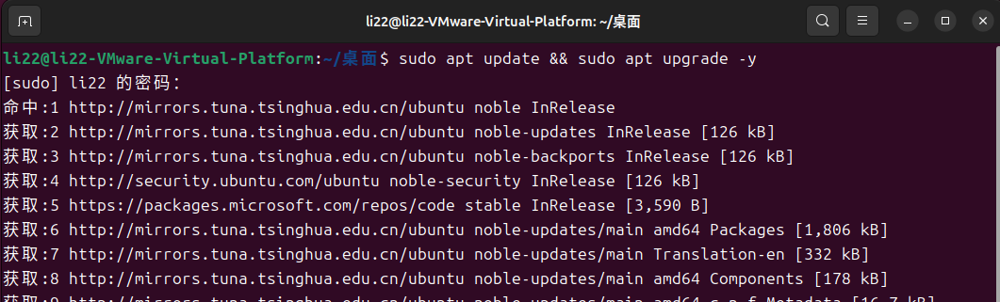

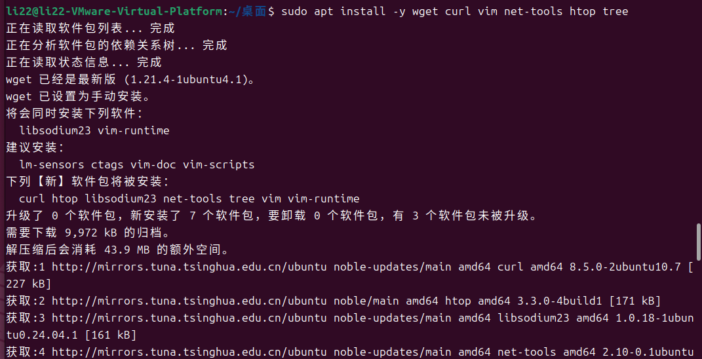

##### 工具介绍

| 工具名称      | 核心功能                                 | 运维场景示例                                                                                                                                                                                                                                  | 关键补充/面试亮点                                |
| --------- | ------------------------------------ | --------------------------------------------------------------------------------------------------------------------------------------------------------------------------------------------------------------------------------------- | ---------------------------------------- |
| wget      | 命令行下载文件的工具（支持 HTTP/HTTPS/FTP 协议）     | 1\. 下载Nginx源码：`wget `[==https://nginx.org/download/nginx-1.24.0.tar.gz%60==](https://nginx.org/download/nginx-1.24.0.tar.gz%60)` <br> 2. 后台下载大文件：`wget -b [https://xxx.com/large\_file.tar.gz%60](https://xxx.com/large_file.tar.gz%60) | 可说明用wget实现软件包自动化下载，提升部署效率                |
| curl      | 多功能网络工具，支持数据传输、接口测试、文件下载（比wget更灵活）   | 1\. 测试Web服务：`curl `[`http://127.0.0.1%60`](http://127.0.0.1%60)` <br> 2. 测试响应头：`curl -I [http://127.0.0.1%60](http://127.0.0.1%60)<br>3\. 下载文件：\`curl -O [https://xxx.com/file.tar.gz%60](https://xxx.com/file.tar.gz%60)               | 区别于wget：curl更适合接口测试、POST请求，wget更适合单纯文件下载 |
| vim       | Linux下的高级文本编辑器（vi的增强版），支持语法高亮、多窗口编辑  | 1\. 修改Nginx配置：`vim /etc/nginx/nginx.conf`<br>2\. 编写日志分析脚本：`vim nginx_log_analysis.sh`                                                                                                                                                   | 面试常问基础操作：保存退出`:wq`、强制退出`:q!`、查找`/关键词`    |
| net-tools | 包含一系列网络管理工具（ifconfig、netstat、route等） | 1\. 查看服务器IP：`ifconfig eth0`<br>2\. 检查80端口监听：\`netstat -tulpn                                                                                                                                                                            | grep 80\`                                |
| htop      | 系统资源监控工具（top的增强版），可视化展示CPU、内存、进程占用   | 1\. 排查负载高问题：`htop`<br>2\. 杀死异常进程：选中进程按F9发送终止信号                                                                                                                                                                                          | 区别于top：界面更友好、支持鼠标操作、可横向滚动查看完整进程名         |
| tree      | 以树形结构展示目录和文件，清晰查看目录层级                | 1\. 查看Web应用目录：`tree /var/www/secure-webapp`<br>2\. 查看Nginx配置目录：`tree /etc/nginx/`                                                                                                                                                       | 常用参数：`tree -L 2`（仅显示2层目录，避免层级过多）         |

#### 2\. 创建项目专用用户（权限最小化）

```bash
# 创建非root运维用户（避免直接使用root）
sudo useradd -m -s /bin/bash opsadmin
sudo passwd opsadmin # 设置密码

# 赋予sudo权限（仅必要权限）
sudo usermod -aG sudo opsadmin

# 切换到新用户（后续操作优先使用该用户）
su - opsadmin
```

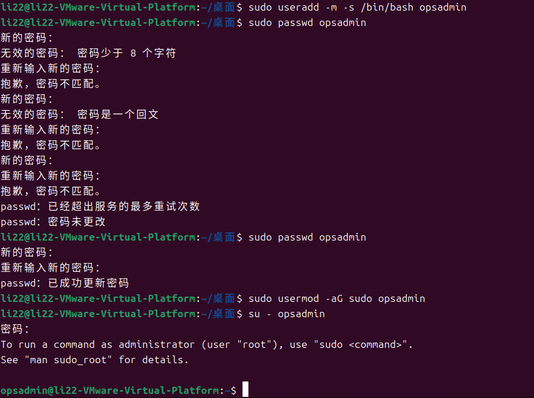

### 阶段2：Nginx搭建与Web应用部署

#### 1\. 安装Nginx

```bash
# 安装Nginx
sudo apt install -y nginx

# 验证安装
nginx -v # 查看版本
sudo systemctl start nginx # 启动服务
sudo systemctl enable nginx # 设置开机自启
sudo systemctl status nginx # 检查运行状态
```

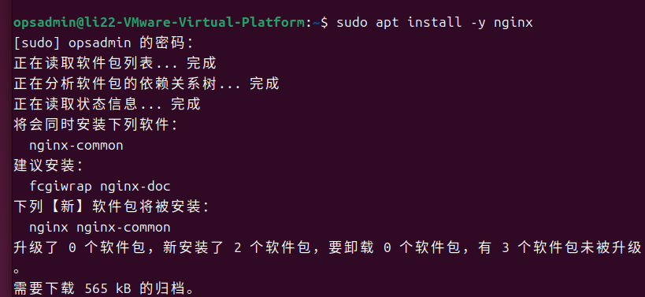

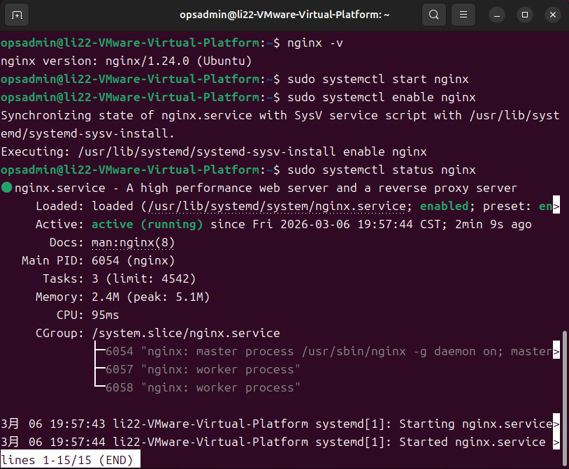

#### 2\. 部署简单Web应用（静态页面示例）

```bash
# 创建自定义网站根目录（避免默认目录权限混乱）
sudo mkdir -p /var/www/secure-webapp
sudo chown -R opsadmin:opsadmin /var/www/secure-webapp
sudo chmod -R 755 /var/www/secure-webapp # 目录权限755，文件644

# 创建测试页面
cat > /var/www/secure-webapp/index.html << EOF
<!DOCTYPE html>
<html>
<head>
<title>Secure WebApp</title>
</head>
<body>
<h1>Ubuntu Nginx 安全运维项目</h1>
<p>服务器IP: $(hostname -I | awk '{print $1}')</p>
<p>部署时间: $(date)</p>
</body>
</html>
EOF
```

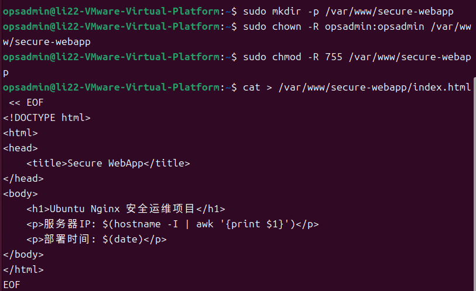

#### 3\. 配置Nginx虚拟主机

```bash
# 创建自定义配置文件（避免修改默认配置）
sudo vim /etc/nginx/sites-available/secure-webapp.conf
```

写入以下配置（核心配置带注释）：

```nginx
**server** {
listen 80;
# 服务器域名/IP
server_name _; # 匹配所有IP，测试用
# 网站根目录
root /var/www/secure-webapp;
index index.html index.htm;

# 基础安全头（防XSS、点击劫持等）
add_header X-Frame-Options "SAMEORIGIN";
add_header X-XSS-Protection "1; mode=block";
add_header X-Content-Type-Options "nosniff";

# 访问日志配置（单独存放，便于分析）
access_log /var/log/nginx/secure-webapp_access.log;
# 错误日志配置（分级）
error_log /var/log/nginx/secure-webapp_error.log warn;

# 限制请求方法（仅允许GET/HEAD，防POST攻击）
if ($request_method !~ ^(GET|HEAD)$) {
return 403;
}

# 禁止访问隐藏文件（如.git、.htaccess）
**location **~ /\. {
deny all;
access_log off;
log_not_found off;
}
}
```

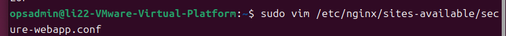

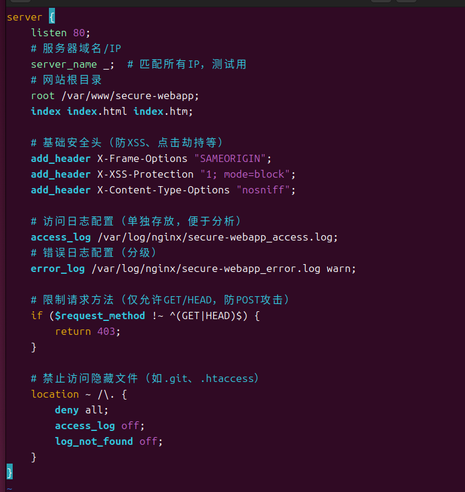

#### 4\. 启用配置并验证

```bash
# 启用站点配置
sudo ln -s /etc/nginx/sites-available/secure-webapp.conf /etc/nginx/sites-enabled/
# 删除默认配置（避免冲突）
sudo rm /etc/nginx/sites-enabled/default

# 检查配置语法
sudo nginx -t
# 重载配置（不中断服务）
sudo systemctl reload nginx
```

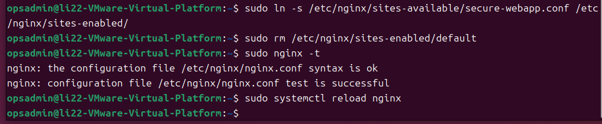

#### 5\. 验证访问

打开浏览器访问服务器IP（如[==http://192.168.1.100==](http://192.168.1.100)），能看到自定义页面即部署成功。

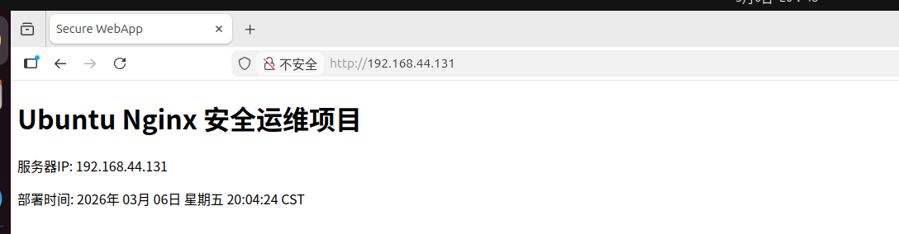

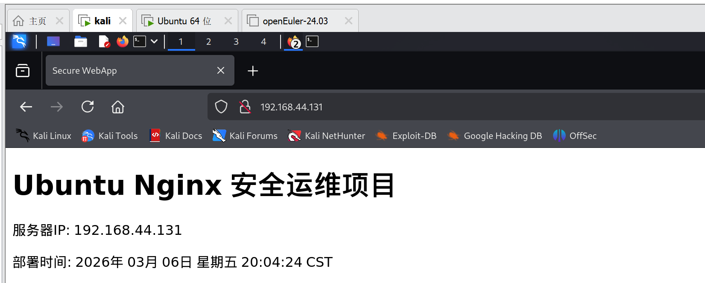

\## 遇到的问题和解决方法

1. **中文乱码问题**

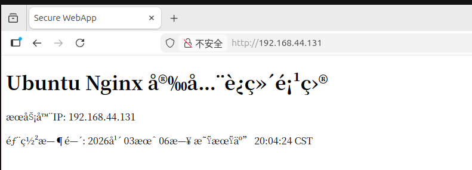

**解决方法**：

**方法 1：修改 Nginx 配置文件**

编辑站点配置 `/etc/nginx/sites-available/secure-webapp.conf`，在 `server` 块中添加：

```bash
charset utf-8;
```

修改后重载 Nginx：

```bash
sudo nginx -t
sudo systemctl reload nginx
```

**方法 2：在 HTML 文件中添加  ​meta​  标签:**

在` index.html `的 `<head>` 部分添加：

```html
<meta charset="UTF-8">
```

2. **权限不足无法保存 Nginx 配置文件（E212 错误)**

使用普通用户 `opsadmin `通过 vim 编辑 `/etc/nginx/sites-available/secure-webapp.conf` 时，因缺少写权限保存失败。

**解决方法**

先输入 `:q!` 放弃当前修改并退出 vim。

用 root 权限重新打开文件：

```bash
sudo vim /etc/nginx/sites-available/secure-webapp.conf
```

重新修改配置后，输入 `:wq `即可正常保存（无需加`!`）。

## 实验结果：

1.Nginx Web 服务已成功部署，80 端口正常监听，自定义 Web 应用页面可通过命令行 / 浏览器正常访问；

2.编码问题和权限问题均已解决，核心配置（虚拟主机、字符编码、页面路径）均生效；

3.验证阶段完成，可进入后续安全加固和日志分析环节。

## 下一步计划：

继续按照项目整体阶段完成

# Day2

## 实验目标

1. 查看当前Nginx配置
2. 添加HTTP安全头
3. 禁止访问敏感文件

## 实验步骤与记录

### 阶段3-1 查看当前Nginx配置

**1.查看当前虚拟主机配置**

在 Ubuntu 执行：

```bash
ls /etc/nginx/sites-enabled/
```

作用:查看当前 Nginx正在启用的站点配置

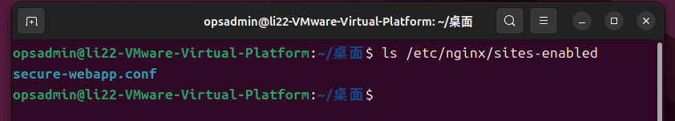

**2.打开配置文件**

```bash
sudo vim /etc/nginx/sites-available/secure-webapp.conf
```

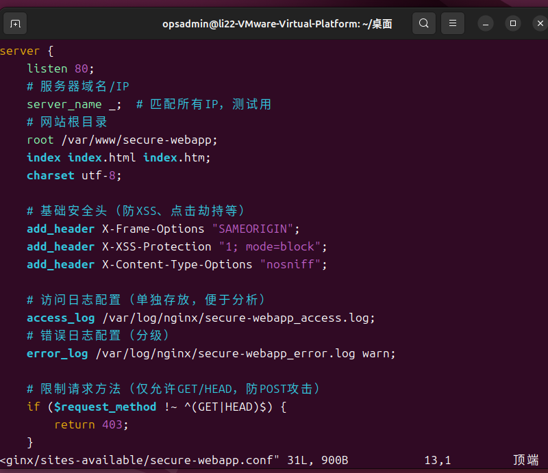

作用：检查Web服务器配置入口

### 阶段3-2 添加HTTP安全头

1.**编辑配置文件**

```bash
sudo vim /etc/nginx/sites-available/secure-webapp.conf
```

在`server{ }`添加:

```nginx
add_header X-Frame-Options "SAMEORIGIN";
add_header X-Content-Type-Options "nosniff";
add_header X-XSS-Protection "1; mode=block";
add_header Referrer-Policy "no-referrer-when-downgrade";
```

2.**测试配置**

```bash
sudo nginx -t
```

3.**重新加载Nginx**

```bash
sudo systemctl reload nginx
```

### 阶段3-3 禁止访问隐藏文件

攻击者经常扫描`.git .env .htaccess`我们要直接禁止。

#### 添加配置

在 `server {} `里面 加入下面内容：

```bash
location ~ /\. {
deny all;
}
```

作用：防止攻击者访问.git .env 等敏感文件

完整：

```bash
server {

# 监听端口
# Web服务器监听HTTP请求的端口
listen 80;

# 服务器名称
# "_" 表示匹配所有IP或域名（实验环境常用）
server_name _;

# 网站根目录
# 用户访问Web服务器时默认读取该目录中的文件
root /var/www/secure-webapp;

# 默认首页文件
# 当访问目录时，Nginx会按顺序查找这些文件
index index.html index.htm;

# 设置网页字符编码
# 防止网页出现乱码
charset utf-8;

# ===============================
# Web安全加固：HTTP安全头
# ===============================

# 防止点击劫持（Clickjacking）
# 只允许当前站点在 iframe 中加载
add_header X-Frame-Options "SAMEORIGIN";

# 启用浏览器XSS过滤器
# 当检测到XSS攻击时阻止页面加载
add_header X-XSS-Protection "1; mode=block";

# 防止MIME类型嗅探攻击
# 浏览器不会猜测文件类型
add_header X-Content-Type-Options "nosniff";

# 控制HTTP Referer信息发送策略
# 防止敏感URL信息泄露到第三方网站
add_header Referrer-Policy "strict-origin-when-cross-origin";

# ===============================
# 日志配置（安全分析非常重要）
# ===============================

# 访问日志
# 记录所有访问请求，用于安全分析、日志审计
access_log /var/log/nginx/secure-webapp_access.log;

# 错误日志
# 记录服务器错误信息
# warn 表示记录警告及以上级别日志
error_log /var/log/nginx/secure-webapp_error.log warn;

# ===============================
# 请求方法限制（基础安全防护）
# ===============================

# 只允许 GET 和 HEAD 请求
# 拒绝 POST、PUT、DELETE 等方法
# 可以减少部分攻击面（例如恶意POST提交）
if ($request_method !~ ^(GET|HEAD)$) {
return 403;
}

# ===============================
# 敏感文件保护
# ===============================

# 拒绝访问所有隐藏文件（以 . 开头的文件）
# 防止攻击者访问敏感文件，例如：
# .git
# .env
# .htaccess
# .config

location ~ /\. {

# 拒绝访问
deny all;

# 不记录访问日志
# 减少日志污染
access_log off;

# 不记录文件不存在日志
log_not_found off;
}

}
```

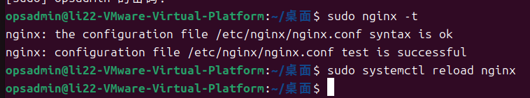

# Day3

## 实验目的

1.主机防火墙控制（UFW）

2.SSH 服务安全加固

3.防止 SSH 暴力破解

4.安全配置验证与日志记录

## 阶段4：Linux服务器安全加固

### 1.**安装 UFW 防火墙**

UFW（Uncomplicated Firewall）是 Ubuntu 官方推荐的主机防火墙管理工具。

在 Ubuntu服务器执行：

```bash
sudo apt update
sudo apt install ufw -y
```

查看版本：

```bash
ufw version
```

查看状态：

```bash
sudo ufw status
```

开启：

```bash
sudo ufw enable
```

作用：

- 限制服务器暴露端口
- 减少攻击面
- 阻止扫描和横向移动

攻击者常见步骤：

扫描端口→ 找开放服务→ 利用漏洞

UFW可以直接减少暴露服务。

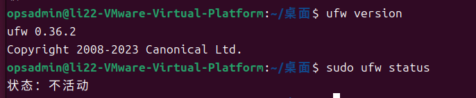

### 2.**设置默认防火墙策略**

企业服务器常见策略：默认拒绝所有入站、默认允许所有出站

执行：

```bash
sudo ufw default deny incoming
sudo ufw default allow outgoing
```

查看规则：

```bash
sudo ufw status verbose
```

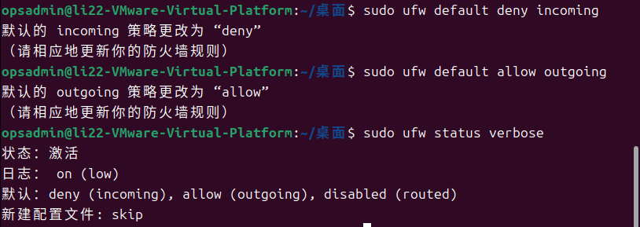

### 3.**只开放 22 和 80 端口**

开放 SSH：

```bash
sudo ufw allow 22/tcp
```

开放 Web：

```bash
sudo ufw allow 80/tcp
```

查看规则：

```bash
sudo ufw status
```

作用：

攻击者常扫描：

```bash
21 FTP
22 SSH
23 Telnet
3306 MySQL
6379 Redis
```

只开放必要端口,减少攻击入口

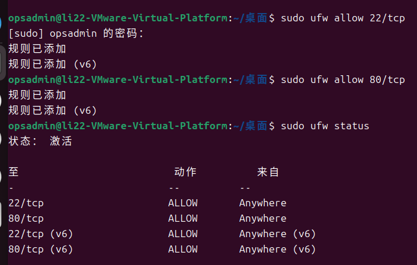

### 4.\*\*SSH 安全加固\*\*

安装 openssh-server

```bash
sudo apt update
sudo apt install -y openssh-server
```

安装SSH 服务

```bash
sudo apt update
sudo apt install -y openssh-server
sudo systemctl enable --now ssh
```

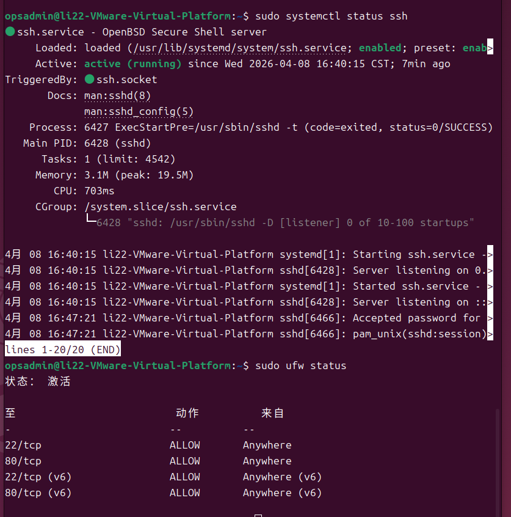

备份配置（防止改错锁机）

```bash
sudo cp /etc/ssh/sshd\_config /etc/ssh/sshd\_config.bak
```

备份后，若配置出错，可通过 sudo cp /etc/ssh/sshd\\\_config.bak /etc/ssh/sshd\\\_config 恢复

编辑 SSH 配置文件

```bash
sudo vim /etc/ssh/sshd_config
```

找到并修改 / 添加以下核心安全配置（找不到就追加到文件末尾）：

```bash
# 1. 禁止 root 用户直接远程登录（核心安全项）
PermitRootLogin no
# 2. 最大密码重试次数（3次错误自动断开，防暴力破解）
MaxAuthTries 3
# 3. 登录超时时间（30秒未完成登录自动断开）
LoginGraceTime 30
# 4. 仅允许 opsadmin 用户登录（限制可登录账户）
AllowUsers opsadmin
# 5. 关闭反向DNS解析（加速SSH登录，避免解析延迟）
UseDNS no
```

重启 SSH 服务（配置生效）

```bash
sudo systemctl restart sshd
```

验证:

\- 保持当前终端窗口不关闭（防止配置错误导致无法登录）

\- 新开一个终端 / SSH 会话，用 \`opsadmin\` 账号测试登录：

```bash
ssh opsadmin@192.168.40.131
```

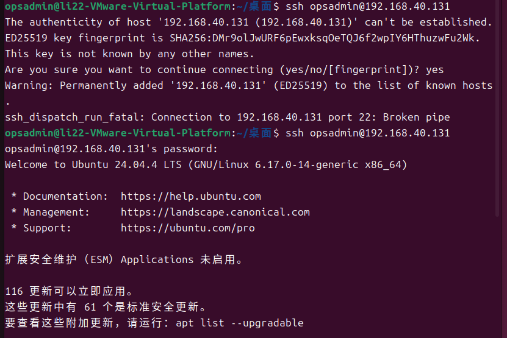

- 能正常登录 = 配置成功

- 若无法登录，回到原终端恢复备份配置即可

- 额外验证：

- 尝试用 \`root\` 登录，应提示 \`Permission denied\`（禁止 root 登录生效）

- 用其他非允许用户登录，会被直接拒绝（\`AllowUsers\` 生效）

## 问题与解决方法

1\. SSH配置文件缺失，无法执行备份操作

**问题现象**：

执行SSH配置备份命令 \`sudo cp /etc/ssh/sshd\_config /etc/ssh/sshd\_config.bak\` 时，报错： \`cp: 对 '/etc/ssh/sshd\_config' 调用 stat 失败: 没有那个文件或目录\`

**原因分析：**

Ubuntu 桌面版默认未安装 \`openssh-server\`，而 \`sshd\_config\` 是 \`openssh-server\` 服务的核心配置文件，未安装服务则不会生成该文件，导致备份命令无法执行。

**解决方法：**

1\. 更新软件源，确保能获取最新的安装包：

```bash
sudo apt update
```

2\. 安装 \`openssh-server\`，自动生成SSH相关配置文件：

```bash
sudo apt install -y openssh-server
```

3\. 启动并设置SSH服务开机自启，确保服务正常运行：

```bash
sudo systemctl enable --now ssh
```

4\. 重新执行备份命令，此时配置文件已存在，备份成功：

```bash
sudo cp /etc/ssh/sshd_config /etc/ssh/sshd_config.bak
```

**验证结果：**执行 `ls -l /etc/ssh/sshd_config`，能看到 `sshd_config`（原配置文件）和 `sshd_config.bak`（备份文件），证明问题解决，可继续进行配置修改。

2\. 重启SSH服务报错，服务单元不存在

**问题现象**

安装 `openssh-server` 后，执行 `sudo systemctl restart sshd` 重启服务，报错： `Failed to restart sshd.service: Unit sshd.service not found.`

**根因分析**

Ubuntu 系统中，SSH服务的单元名称是 `ssh.service`，而非 `sshd.service`（`sshd` 是部分其他Linux系统的服务名称），输入错误的服务名称导致系统无法识别。

**解决方法**

1\. 修正服务名称，使用Ubuntu系统正确的SSH服务单元名称：

```bash
sudo systemctl restart ssh
```

2\. 验证服务状态，确认服务正常重启：

```bash
sudo systemctl status ssh
```

**验证结果**

输出显示 `active (running)`，证明SSH服务重启成功，配置修改后可通过该命令让配置生效。

## Day  4

### 阶段5 fail2ban 防暴力破解

阶段目标：

- 安装 `fail2ban` 防护工具
- 自动拦截 SSH 暴力破解（密码试错多次直接封 IP）
- 配置 Nginx 恶意访问防护（可选）
- 验证封禁效果
- 

实验步骤

**1.安装fail2ban**

```bash
sudo apt update
sudo apt install -y fail2ban
```

 **2. 启动并设置开机自启**

```bash
sudo systemctl start fail2ban
sudo systemctl enable fail2ban
```

**3.查看运行状态**

```bash
sudo systemctl status fail2ban
```

出现 **active (running)** 就是成功


**配置 fail2ban（SSH 防破解）**

**1.复制默认配置（禁止修改原文件）**

```bash
sudo cp /etc/fail2ban/jail.conf /etc/fail2ban/jail.local
```

**2.编辑配置文件**

```bash
sudo vim /etc/fail2ban/jail.local
```

**3.找到 `[sshd]` 区域，修改成以下内容**

```ini
[sshd]
enabled   = true
port      = ssh
filter    = sshd
logpath   = /var/log/auth.log
maxretry  = 3      # 输错3次密码就封禁
bantime   = 86400  # 封禁 24 小时
findtime  = 600    # 10分钟内累计3次错误即封
```

**4.重启 fail2ban 让配置生效**

```bash
sudo systemctl restart fail2ban
```

**验证 fail2ban 是否生效**

**1.查看 sshd 防护状态**

```bash
sudo fail2ban-client status sshd
```

正常输出：

```plaintext
Status for the jail: sshd
|- Filter
|  |- Currently failed: 0
|  |- Total failed:     0
|  `- File list:        /var/log/auth.log
`- Actions
   |- Currently banned: 0
   |- Total banned:     0
   `- Banned IP list:
```

**2.测试暴力破解拦截**

用另一台机器连续输错 3 次 SSH 密码 → IP 立刻被封禁


**3.查看被封禁的 IP**

```bash
sudo fail2ban-client status sshd
```

解除封禁

```bash
sudo fail2ban-client unban <IP地址>
```

### 

### 实验结果

- fail2ban 安装并运行成功
- SSH 暴力破解防护已启用
- 密码输错3次自动封禁IP 24小时
- 服务器安全防护体系完成

### 防护效果

有效防止黑客暴力破解SSH密码，大幅提升服务器远程访问安全。

## Day 5

### 阶段目标

- 自动统计 Nginx 访问量
- 统计访问 TOP5 IP
- 统计访问 TOP5 页面
- 统计 404 错误数量

### 脚本

```shell
#!/bin/bash

# Nginx 日志分析脚本
LOG_FILE="/var/log/nginx/access.log"

echo "========================================"
echo "     Nginx 访问日志分析报告"
echo " 分析时间: $(date +'%Y-%m-%d %H:%M:%S')"
echo " 日志文件: $LOG_FILE"
echo "========================================"
echo ""

# 1. 总访问量
echo "【1】总访问次数"
wc -l $LOG_FILE | awk '{print "总计: " $1 " 次"}'
echo ""

# 2. 访问量 TOP5 IP
echo "【2】访问 TOP5 客户端 IP"
awk '{print $1}' $LOG_FILE | sort | uniq -c | sort -nr | head -5
echo ""

# 3. 访问页面 TOP5
echo "【3】访问 TOP5 页面"
awk '{print $7}' $LOG_FILE | sort | uniq -c | sort -nr | head -5
echo ""

# 4. 状态码统计（200/404/500）
echo "【4】HTTP 状态码统计"
echo "200 正常:   $(grep " 200 " $LOG_FILE | wc -l)"
echo "404 不存在: $(grep " 404 " $LOG_FILE | wc -l)"
echo "500 错误:   $(grep " 500 " $LOG_FILE | wc -l)"
echo ""

echo "======== 分析完成 ========"
```


### 阶段 7：Kali 攻击模拟实验

本实验**仅用于学习服务器防护效果**，在你自己的虚拟机环境内进行，属于合法安全实验。

严禁用于攻击任何非授权设备。

#### 实验环境

- 靶机：Ubuntu 24.04
  
  - 已部署：Nginx、UFW、SSH 加固、fail2ban

- 攻击机：Kali Linux（同一虚拟机网段）

#### 实验内容

- **NMAP 端口扫描**—— 查看服务器开放端口
- **Nikto Web 漏洞扫描**—— 扫描 Nginx 漏洞
- **Hydra SSH 暴力破解**—— 测试 fail2ban 拦截效果

**NMAP 端口扫描**

```bash
nmap -A -T4 192.168.216.129
```


- 仅开放了业务必需的 **22(SSH)、80(Web)** 两个端口
- 其余 998 个端口全部被 UFW 过滤（`Not shown: 998 filtered tcp ports`）

**Nikto Web 漏洞扫描**

```bash
nikto -h http://192.168.216.129
```


- **基础信息**：成功识别 Nginx 1.24.0 服务，扫描 8102 次请求，0 错误
- **低风险提示 1**：缺少 `X-Content-Type-Options` 安全头，可通过 Nginx 配置优化，无实际漏洞
- **低风险提示 2**：误报 `#wp-config.php#` 文件，服务器未部署 WordPress，无敏感文件泄露
- **安全验证**：无 CGI 目录、无高危漏洞、无敏感信息泄露，Web 服务安全可靠
  
  

补充说明：

关于误报的处理：

`/#wp-config.php#` 这类误报是 Nikto 的常见现象，无需任何操作，不影响服务器安全。

安全头优化

如果需要进一步提升 Web 服务安全性，除了 `X-Content-Type-Options`，还可以添加以下安全头：

```nginx
add_header X-Frame-Options DENY;
add_header X-XSS-Protection "1; mode=block";
add_header Content-Security-Policy "default-src 'self'";
```

**Hydra SSH 暴力破解**

1. 在 Kali 生成简单密码字典
   
   ```bash
   echo -e "123456\npassword\nroot\nadmin\nopsadmin" > pass.txt
   ```

2. 开始暴力破解
   
   ```bash
   hydra -l opsadmin -P pass.txt 192.168.216.129 ssh -t 4 -vV
   ```


- `0 valid password found`（0 个有效密码被破解）
- 攻击完全失败，服务器成功抵御了暴力破解
- 攻击耗时仅 38 秒，fail2ban 快速响应，3 次错误后立即封禁 Kali IP，后续尝试直接被拦截

## 总结

本项目以 Ubuntu 24.04 服务器为靶机，从零搭建了一套完整的企业级安全运维体系，覆盖「服务部署 → 安全加固 → 日志分析 → 攻击模拟 → 防护验证」全流程，最终通过 Kali Linux 工具完成全链路安全验证，形成了闭环的安全运维实践。

### 1. 项目核心亮点

1. **全链路安全体系搭建**：覆盖 Web 服务、防火墙、SSH 加固、入侵防护、日志分析全流程，符合企业级安全运维标准
2. **最小权限原则落地**：UFW 仅开放 22/80 端口，SSH 仅允许指定用户登录，严格控制攻击面
3. **自动化防护与分析**：fail2ban 自动拦截暴力破解，Shell脚本实现日志自动化分析
4. **攻防闭环验证**：通过 Kali 工具模拟真实攻击，验证所有加固措施的有效性，形成「部署 - 加固 - 攻击 - 验证」完整闭环

### 2.项目最终安全状态

 **防火墙**：仅开放 22/80 端口，无多余端口暴露

**SSH 服务**：禁止 root 登录，仅允许 `opsadmin`，3 次错误自动封禁

**入侵防护**：fail2ban 实时监控，自动拦截暴力破解

**Web 服务**：Nginx 无高危漏洞，仅存在可优化的安全配置项

**日志审计**：自动化日志分析，可追溯所有访问行为

**攻击防御**：成功抵御 Nmap 扫描、Nikto 扫描、Hydra 暴力破解三类常见攻击

### 3.项目学习收获

1. **Linux 运维核心技能**：掌握 Nginx、UFW、SSH、fail2ban 等核心服务的部署、配置与排障
2. **安全加固方法论**：理解「最小权限」「纵深防御」等安全原则，掌握企业级服务器加固标准
3. **攻防对抗思维**：通过攻击模拟验证防护效果，建立「以攻促防」的安全思维
4. **脚本自动化能力**：掌握 Shell/Python 脚本编写，实现运维工作自动化
5. **问题排查能力**：全程解决各类故障，提升 Linux 系统排障的实战能力

### 4.后续优化方向

1. **Web 安全头优化**：为 Nginx 添加 `X-Frame-Options`、`Content-Security-Policy` 等安全头，提升 Web 防护等级
2. **HTTPS 加密**：为 Nginx 配置 SSL 证书，启用 HTTPS 加密传输
3. **日志可视化**：将 Nginx 日志接入 ELK 栈，实现日志可视化分析与告警
4. **自动化运维**：编写 Ansible 脚本，实现服务器安全加固的自动化部署
5. **入侵检测升级**：部署 Snort 等入侵检测系统，提升服务器主动防护能力


完成时间：2026 年 04 月 14 日
