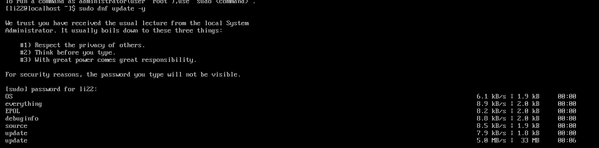
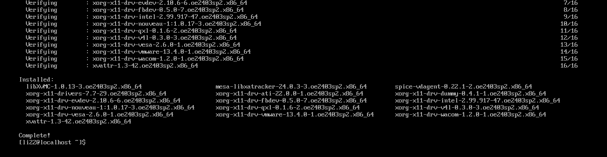
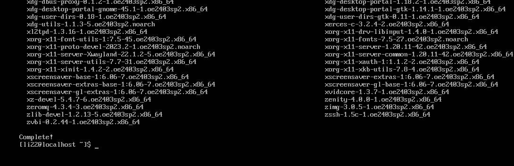
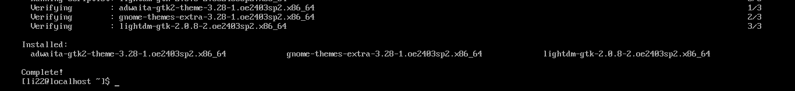
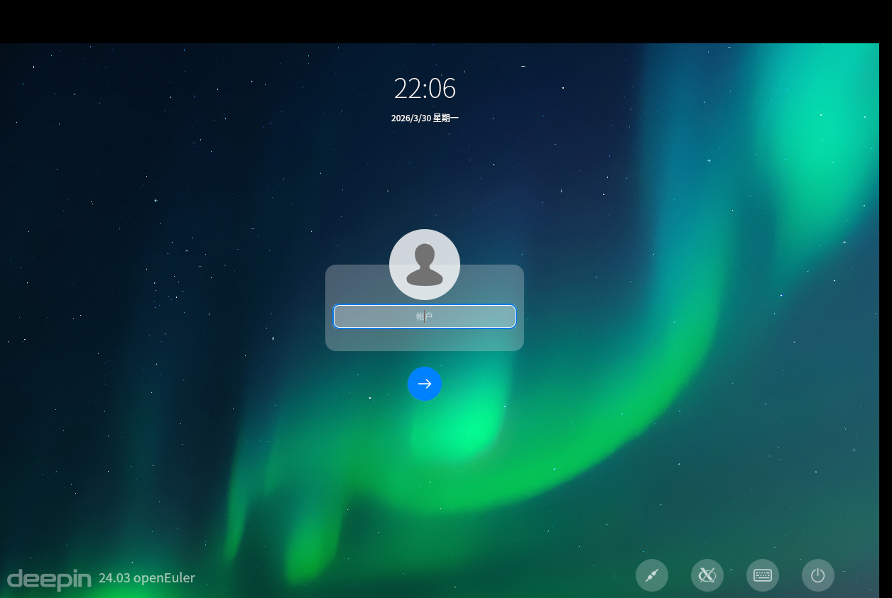
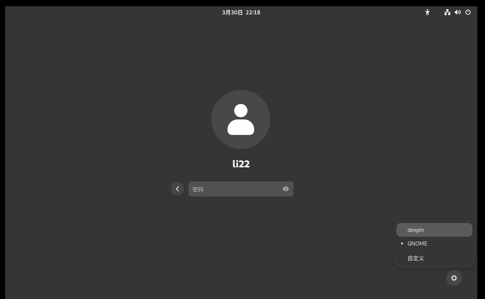

# euler图形化桌面安装

之前的课程中我们已经完成了Euler系统和Ubuntu的安装了，并在Euler系统上完成了操作系统安全的实验一

现在，进行euler图形化双桌面的安装

## 1. 更新系统并启用 EPOL 仓库

首先确保系统为最新状态，并启用 openEuler 的 EPOL（Extra Packages for openEuler）仓库，其中包含了 DDE 桌面环境的相关软件包。

```bash
# 更新系统
sudo dnf update -y
sudo dnf makecache
```




执行完第一步就开始踩坑了，会遇到没有epol的库的问题，但是能执行sudo dnf makecache说明仓库没问题,就直接安装库

## 2. 安装 GNOME 桌面环境

GNOME 是 openEuler 默认支持的桌面之一，可以直接从官方仓库安装。

再次踩坑：网上的命令更新不及时，导致不停报错

先查看可用组名（确认是否有其他桌面组）

先执行命令列出所有可用软件组，找到 openEuler 24.03 实际存在的桌面组：

```bash
dnf group list --hidden
```

dnf group list 列出了所有可用软件组，可以清晰地看到 "GNOME Applications" 和 "X Window System" 组。这是 openEuler 24.03 标准的桌面安装方式

安装完整的 GNOME 桌面（包含应用组和图形服务器）：

```bash
Sudo dnf groupinstall -y"GNOME Applications""X Window System"
```

安装完成后，GNOME 的会话文件会自动注册到显示管理器中。



## 3.安装 DDE 桌面环境

DDE（Deepin Desktop Environment）在 EPOL 仓库中提供，执行以下命令安装：

```bash
sudo dnf makecache
sudo dnf install dde -y
```




注意：安装 DDE 时会自动拉取一些依赖，包括 lightdm 显示管理器。如果系统已安装其他显示管理器（如 gdm），可能会产生冲突。建议统一使用 lightdm。

## 4. 配置显示管理器（LightDM）

为了确保两个桌面都能正常显示并允许切换会话，我们选择使用 LightDM，因为 DDE 对 LightDM 支持最佳。

### 4.1 安装 LightDM

```bash
Sudo dnf install-ylightdm lightdm-gtk-greeter
```




### 4.2 设置 LightDM 为默认显示管理器

```bash
# 关闭 GNOME 自带的 GDM 管理器
sudo systemctl disable --now gdm

# 开启 LightDM 管理器
sudo systemctl enable --now lightdm
```

执行到这儿，已经有桌面化了，但是没找到切换的地方



执行

```bash
sudo rm /etc/systemd/system/display-manager.service
sudo systemctl enable --now gdm
```



# 总结

\## 一、核心目标

在 openEuler 24.03 上安装 **DDE（深度桌面）+ GNOME** 双桌面环境，并实现自由切换。

---

## 二、遇到的问题与解决方法

### 1. 桌面组名不存在，无法安装 GNOME

**问题表现**：

执行 `sudo dnf groupinstall -y "GNOME"` 或 `"GNOME Desktop"` 时，提示 `Module or Group 'XXX' is not available`，连 `"Server with GUI"` 也不存在。

**原因**：

openEuler 24.03 没有预定义的 GNOME 桌面组，需要通过组件组安装。

**解决方法**：

```bash
sudo dnf groupinstall -y "GNOME Applications" "X Window System"
```

---

### 2. EPOL 仓库不存在，无法安装 DDE

**问题表现**：

执行 `sudo dnf config-manager --set-enabled epol` 提示 `No matching repo to modify`；尝试安装 `epol-release` 包提示 `No match for argument`；直接下载 RPM 包返回 404。

**原因**：

`epol` 仓库需要先安装源文件，且包名/路径容易写错。

**解决方法**：

手动创建仓库配置文件：

```bash
sudo tee /etc/yum.repos.d/openEuler-epol.repo << 'EOF'
[EPOL]
name=openEuler EPOL
baseurl=https://repo.openeuler.org/openEuler-24.03-LTS-SP2/EPOL/x86_64/
enabled=1
gpgcheck=1
gpgkey=https://repo.openeuler.org/openEuler-24.03-LTS-SP2/OS/x86_64/RPM-GPG-KEY-openEuler
EOF
sudo dnf clean all && sudo dnf makecache
```

然后安装 DDE：

```bash
sudo dnf install -y dde
```

---

### 3. LightDM 登录器坑：无法切换桌面 + 服务崩溃

**问题表现**：

- 登录界面极简，**没有桌面切换按钮**，只能默认进入 DDE。
- 尝试修改配置时，`vim` 命令不存在，且路径拼写错误（`difhtdm`）。
- 执行 `sudo systemctl stop lightdm` 时出现 `general protection fault` 内核报错。
- 想切换到 GDM 时，提示 `display-manager.service` 软链接已存在，无法覆盖。

**原因**：

- `lightdm-deepin` 主题默认隐藏会话切换按钮。
- `lightdm-deepin` 在 openEuler 24.03 上稳定性差，易导致服务崩溃。
- LightDM 会强制创建 `display-manager.service` 软链接，阻碍切换到其他登录器。

**解决方法**：

1. **删除冲突软链接**：

```bash
sudo rm /etc/systemd/system/display-manager.service
```

2. **切换到 GDM（GNOME 登录器）**：

```bash
sudo systemctl enable --now gdm
sudo systemctl set-default graphical.target
sudo reboot
```

3. **GDM 登录界面直接提供桌面切换按钮**（右下角齿轮图标），无需额外配置。

---

### 4. 编辑器缺失，无法修改配置

**问题表现**：

执行 `sudo vim /etc/lightdm/lightdm.conf` 提示 `vim: command not found`。

**原因**：

openEuler 最小化安装默认不带 `vim`。

**解决方法**：

安装轻量编辑器 `nano`（操作更友好）：

```bash
sudo dnf install -y nano
```

或安装 `vim-minimal`：

```bash
sudo dnf install -y vim-minimal
```

---

### 5. 命令拼写错误导致操作失败

**问题表现**：

- 路径写错：`/etc/difhtdm/lightdm.conf`（多了 `h`）、`/etc/systemd/system/sdisplay-manager.service`（多了 `s`）。
- 包名写错：`epol-release` 应为 `openEuler-epol-release`。

**解决方法**：

仔细核对命令/路径拼写，或直接复制完整命令执行。

---

\## 三、最终成功状态

- DDE + GNOME 双桌面环境已安装完成。
- 登录界面（GDM）提供**桌面切换按钮**，可自由选择 `deepin` 或 `GNOME`。
- 系统默认启动图形界面，无需手动切换。
- 登录后可通过 `echo $XDG_CURRENT_DESKTOP` 验证当前桌面环境。


