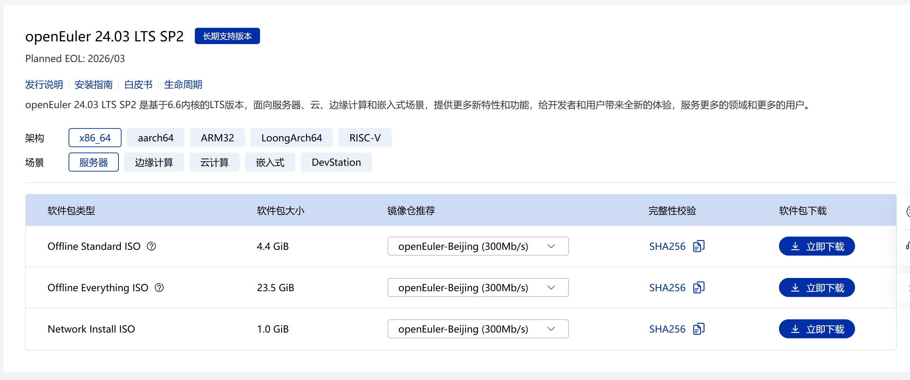
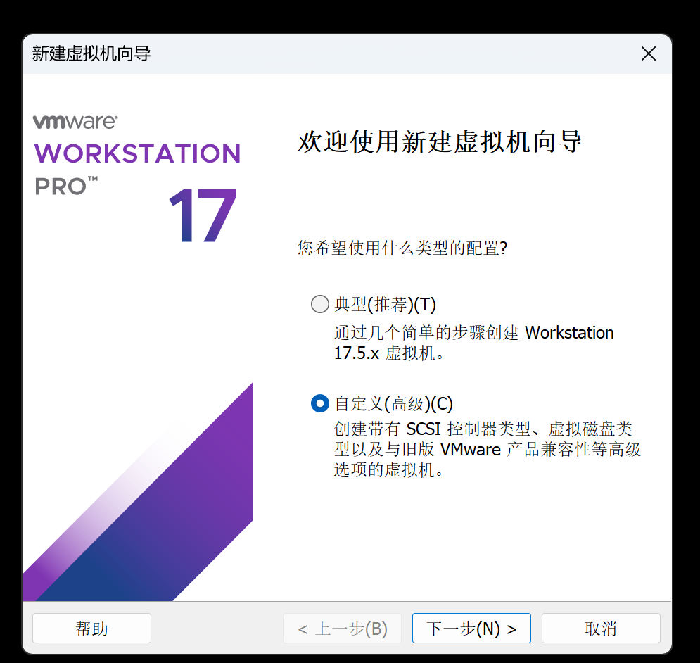
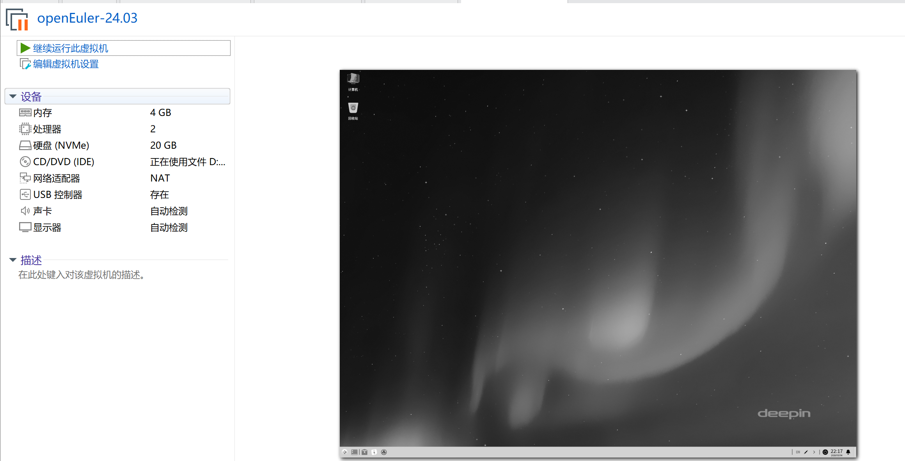
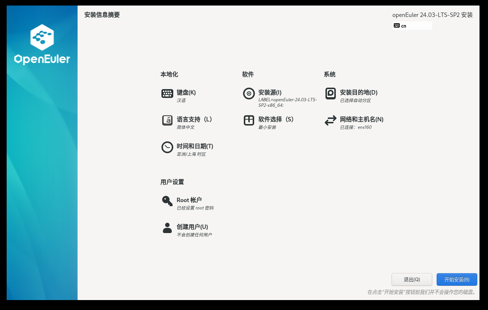
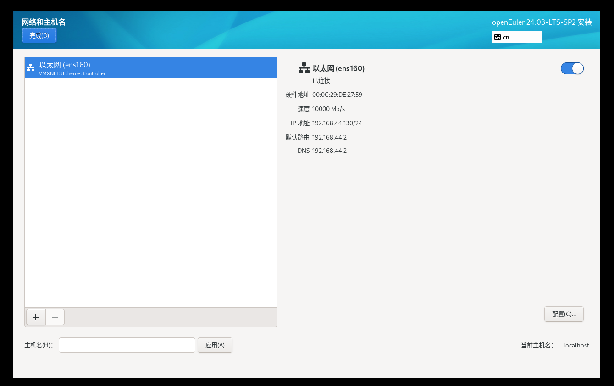
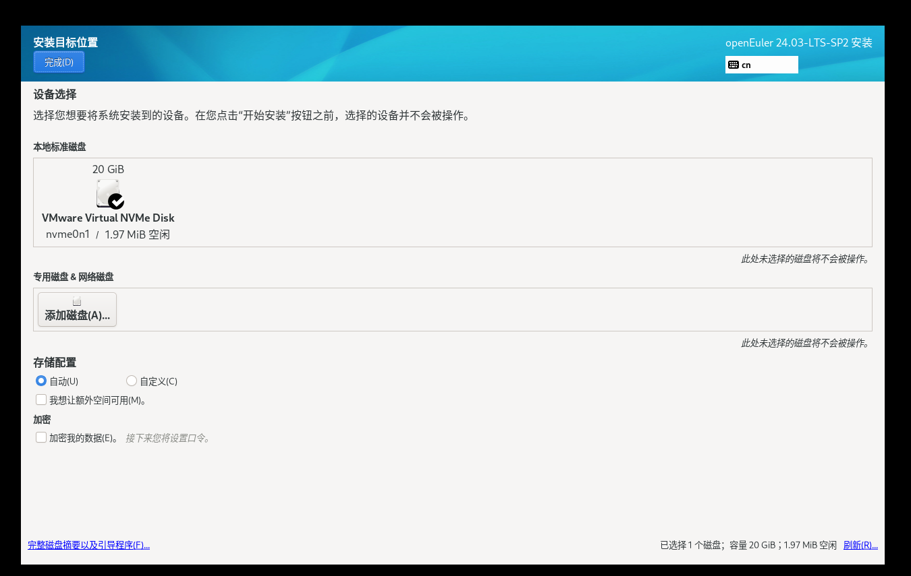
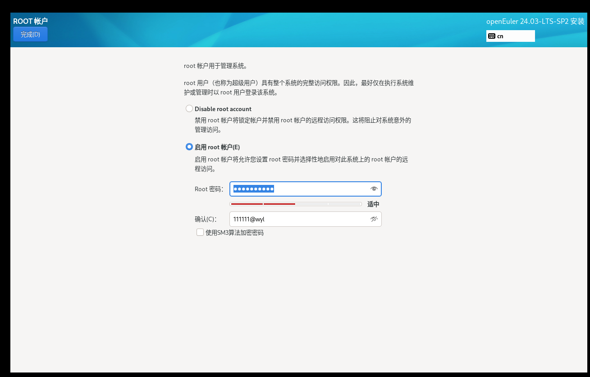
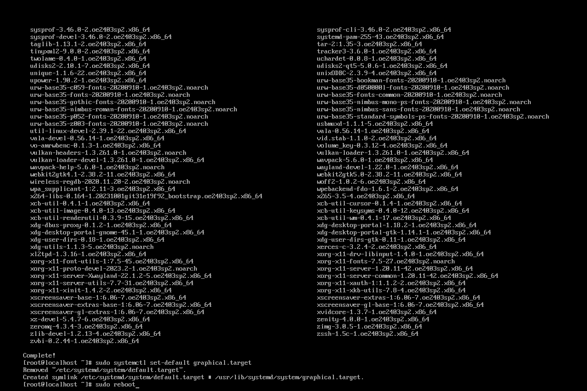
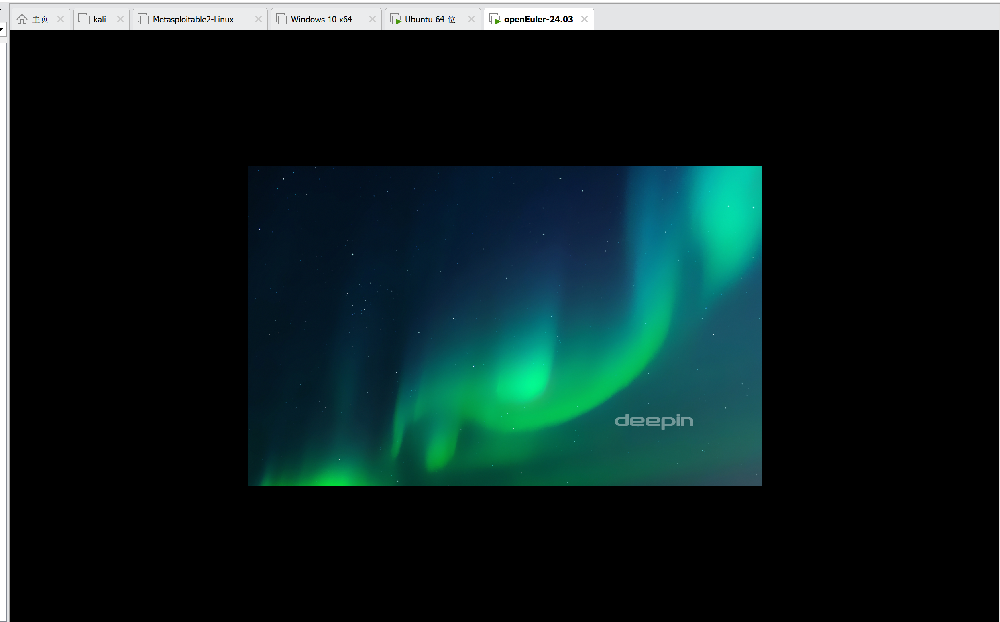

由于课程需要，今天我有如下任务：

1.安装欧拉系统（欧拉和麒麟二选一，老师说这两个差不多，上课老师用欧拉做的示范所以选择欧拉系统）

2.重新安装Ubuntu系统（之前有Ubuntu18，版本太低了，所以重新安装，虽然也有Windows上的Ubuntu系统，还是重新安装24版本），并给Ubuntu系统安装vscode,下载千问的插件，方便后续行课

现在进行欧拉系统的安装：

1.选择Offline Standard ISO版本，大小合适

[openEuler下载 | openEuler ISO镜像 | openEuler社区](https://www.openeuler.openatom.cn/zh/download/)

2.之前有安装虚拟机的经验，所以整个过程还是比较顺利的，除了等待光盘映像下载和虚拟机的安装比较耗时间

2.1新建虚拟机，由于没有给整个过程截图，所以可能没有那么详细

主要是几个选择配置，这是我的配置：

系统版本选择：我选择的是contos 8 64位（老师说选怎其他Linux 6）

看了别的配置过程，有选择其他Linux版本的，也有red hat版本的，看不出来很大的差别（虽然我看了别人的配置过程，删除重新装过）

2.2进入虚拟机的具体配置：

网络：

磁盘

Root:（我还配置了一个用户）

2.3桌面化（刚安装好还是终端形式）

|sudo dnf install -y dde sudo systemctl set-default graphical.target sudo reboot|
|-------------------------------------------------------------------------------------|

安装好的样子，其内核还是Linux系统，所以在安装好后还是有熟悉感的

接下来是Ubuntu24的安装：

1.换源，不然光盘映像不知道要花多久时间才能下载下来

换源网址：

|阿里云镜像站：https://mirrors.aliyun.com/ubuntu-releases/24.04/ 清华大学镜像站：https://mirrors.tuna.tsinghua.edu.cn/ubuntu-releases/24.04/ 中国科学技术大学镜像站：https://mirrors.ustc.edu.cn/ubuntu-releases/24.04/ 华为云镜像站：https://mirrors.huaweicloud.com/ubuntu-releases/24.04/ 网易镜像站：https://mirrors.163.com/ubuntu-releases/24.04/|
|--------------------------------------------------------------------------------------------------------------------------------------------------------------------------------------------------------------------------------------------------------------------------------------------------------------------------|

剩下的就很快了，因为VMware可以识别ubuntu 的系统，直接同意安装即可

下载vscode，在应用商店比较慢，所以我在Firefox上下载了安装包，软件商店识别后直接安装的比较快。

安装工作到此为止了

